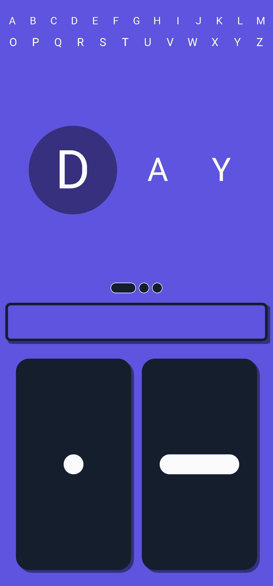

# Lite Morse Trainer


<a href="https://play.google.com/store/apps/details?id=com.soloduo.morse_learn">
  
</a>


This is a flutter project of a simple 'Morse Code' trainer.

## 📸 images

|                     Screenshot1                      |                     Screenshot2                      |                     Screenshot3                      |                     Screenshot4                      |
| :--------------------------------------------------: | :--------------------------------------------------: | :--------------------------------------------------: | :--------------------------------------------------: |
|  |  |  |  |

## 🏁 Getting Started

These instructions will get you a copy of the project up and running on your local machine for development and testing purposes.

### Prerequisites

```
flutter
```

### Installing

Steps:


1) Clone/ Download the repository

2) Install the packages from the command line:

```
flutter pub get
```

3) And to generate, app imports and delegate run (for internationalization):

```
flutter gen-l10n --untranslated-messages-file=lib/l10n
```

## Built With

- [Flutter](https://flutter.dev/) - The mobile framework used.
- [Audioplayers](https://github.com/luanpotter/audioplayers) - A Flutter plugin to play multiple simultaneously audio files.
- [Vibration](https://github.com/benjamindean/flutter_vibration) - A plugin for handling Vibration API on iOS and Android devices.
- [Share](https://github.com/flutter/plugins/tree/master/packages/share) - A Flutter plugin to share content from your Flutter app via the platform's share dialog.
- [Shared Preferences](https://github.com/flutter/plugins/tree/master/packages/shared_preferences) - Wraps NSUserDefaults (on iOS) and SharedPreferences (on Android), providing a persistent store for simple data.
- [Flutter Launcher Icons](https://github.com/fluttercommunity/flutter_launcher_icons) - A command-line tool which simplifies the task of updating your Flutter app's launcher icon.

## Authors

- **Skender Lahdhiri** - _Initial work_ - [Skenderl](https://github.com/skenderl)

## License

This project is licensed under the MIT License - see the [LICENSE.md](LICENSE.md) file for details
